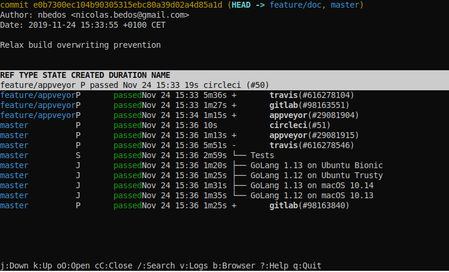

[](https://travis-ci.org/nbedos/citop/builds)

# citop
A UNIX program that displays information about pipelines of Continuous
Integration services. citop stands for Continous Integration Table Of Pipelines.



[Animated demo \[SVG, 290kB\]](https://nbedos.github.io/citop/demo.svg)

# Project status
citop is under active development and not yet ready for public release.

Integration with a few CI providers has been implemented and is usable.

The remaining steps before a first alpha release are:
* Implementing application configuration (essentially for credentials in a first time)
* Improving quality by adding tests

# Features
## Monitor pipelines of repositories hosted on GitHub or GitLab from the command line
This is as simple as running `git push && citop` to monitor the pipelines triggered by your last
`push` or running `citop <commit>` to monitor a specific commit. citop will show the status, timings
and logs of pipelines, stages and jobs.

## Integration with Travis CI, AppVeyor, CircleCI and GitLab CI
For repositories that rely on multiple CI providers this allows monitoring pipelines of multiple
providers in a single place.

## Quick access to pipeline web pages
Just select the pipeline, stage or job you're interested in and press 'b' to open the corresponding
web page on the CI provider's website. This gives easy access to features offered by CI providers
that are not implemented by citop (pipeline cancellation, artifact download...)

# Installation
Install from source by running the following commands. Requires golang >= 1.12 and a UNIX system.
```shell
$ git clone git@github.com:nbedos/citop.git
$ go build .
```

# Configuration
citop requires access to various APIs. Credentials are stored in a configuration file located
at `$XDG_CONFIG_HOME/citop/citop.toml` which usually defaults to `~/.config/citop/citop.toml`.

Below is an example of a minimal configuration file. Each API token must be replaced by your own
token. For each service, the [manual page](https://nbedos.github.io/citop/man.html) has a link
to the web page dedicated to API token management.
```toml
[[providers.github]]
token = "github_api_token"

[[providers.gitlab]]
token = "gitlab_api_token"

[[providers.travis]]
url = "org"
token = "travis_org_api_token"

[[providers.appveyor]]
token = "appveyor_api_key"

[[providers.circleci]]
token = "circleci_api_token"
```

You may remove the section for any one service but do note that citop needs access to at
least one of GitLab or GitHub (depending on where your repositories are hosted) and at least one
of GitLab, Travis, AppVeyor or CircleCI depending on which CI provider you use.

# Usage
```
usage: citop [-r REPOSITORY | --repository REPOSITORY] [COMMIT]
       citop -h | --help
       citop --version

Monitor CI pipelines associated to a specific commit of a git repository

Positional arguments:
  COMMIT        Specify the commit to monitor. COMMIT is expected to be
                the SHA identifier of a commit, or the name of a tag or
                a branch. If this option is missing citop will monitor
                the commit referenced by HEAD.

Options:
  -r REPOSITORY, --repository REPOSITORY
                Specify the git repository to work with. REPOSITORY can
                be either a path to a local git repository, or the URL
                of an online repository hosted at GitHub or GitLab.
                Both web URLs and git URLs are accepted.

                In the absence of this option, citop will work with the
                git repository located in the current directory. If
                there is no such repository, citop will fail.

  -h, --help    Show usage

  --version     Print the version of citop being run
```

## Examples
Show pipelines associated to the HEAD of the current git repository
```shell
citop
```

Show pipelines associated to a specific commit, tag or branch
```shell
citop 64be3c6
citop 0.9.0
citop feature/doc
```

Show pipelines of a repository specified by a URL
```shell
citop -r https://gitlab.com/nbedos/citop
citop -r git@github.com:nbedos/citop.git
citop -r github.com/nbedos/citop
```

Show pipelines of a local repository specified by a path
```shell
citop -r /home/user/repos/myrepo
```

Specify both repository and commit
```shell
citop -r github.com/nbedos/citop 64be3c6
```

More information is available in the [manual page](https://nbedos.github.io/citop/man.html).